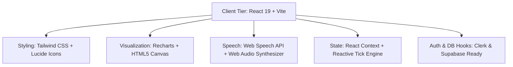

<div align="center">

# 📈 StockSense AI
### *Next-Generation Accessible Financial Intelligence & Real-Time Market Analytics*

[](https://react.dev/)
[](https://vitejs.dev/)
[](https://tailwindcss.com/)
[](https://developer.mozilla.org/en-US/docs/Web/API/Web_Speech_API)
[](https://opensource.org/licenses/MIT)

<p align="center">
  <b>Built for Odoo Combat Hackathon</b> • Empowering First-Time Investors, Everyday Retail Traders, and Regional Language Speakers
</p>

[Explore Live Demo](#-getting-started) • [Key Features](#-core-capabilities) • [System Architecture](#-system-architecture) • [Setup Guide](#-installation--setup)

---

</div>

## 📌 Executive Summary

Modern financial trading platforms are often cluttered with intimidating jargon, convoluted order books, and impenetrable technical charts. This creates a severe barrier to entry for novice investors, rural communities, and non-native English speakers.

**StockSense AI** bridges this gap. It is an ultra-accessible, intelligent stock tracking and investment advisory platform engineered with a human-first philosophy. Designed with the effortless ergonomics of everyday consumer apps like WhatsApp and YouTube, StockSense demystifies capital markets through:

1. **Intuitive Visual Heuristics**: Universal traffic-light decision indicators (🟢 Buy, 🟡 Hold, 🔴 High Risk).
2. **Multilingual Speech Synthesis**: Instant voice readouts of live prices, rate changes, and AI verdicts in **English**, **हिन्दी (Hindi)**, and **தமிழ் (Tamil)**.
3. **Dual-Experience UI**: Seamless toggling between **Beginner Mode** (plain language summaries, zero jargon) and **Pro Mode** (candlestick charts, RSI, moving averages, volume breakouts).

---

## 🌟 Core Capabilities

### 1. ♿ Inclusive Multilingual Voice Engine
- **One-Touch Voice Prompts**: Dedicated live audio triggers (`🔊 English`, `🔊 हिन्दी`, `🔊 தமிழ்`) located directly beside live ticking prices and stock cards.
- **Audio Tactile Feedback**: High-frequency web audio touch tones confirm user interactions instantly.
- **Train-Station PA Announcer**: Emulates high-clarity public address chime systems for ambient market updates and major price movements.
- **Microphone Voice Search**: Query any asset (e.g., *"Reliance"*, *"Tata Motors"*, *"Apple"*) naturally via Web Speech recognition.
- **Floating Live Speech Subtitle**: Dynamic audio waveform visualizer and subtitles with instant pause/stop controls.

### 2. 🚦 Universal Traffic-Light Advisory
- 🟢 **Safe / Good Buy**: Strong fundamental balance sheet, consistent earnings momentum, low volatility.
- 🟡 **Neutral / Hold**: Sideways consolidation, balanced risk-reward ratio, awaiting earnings catalyst.
- 🔴 **Caution / High Risk**: Elevated beta, macro headwinds, or extended overbought valuations.

### 3. 🤖 WhatsApp-Style "StockSense AI Friend"
- Interactive assistant embedded with familiar messaging aesthetics (green status indicators, read receipts, simulated typing pulses).
- Quick-tap starter prompts for zero-typing financial queries:
  - *"Should I invest ₹1,000 today?"*
  - *"Which stock is safest for beginners?"*
  - *"Explain P/E ratio like I'm 10 years old"*
  - *"Is Tata Motors a good long-term hold?"*
- Integrated vocal narration for every response.

### 4. 📊 Dual Mode Analytical Engine
| Feature | Beginner Mode | Pro Mode |
| :--- | :--- | :--- |
| **Visual Charts** | Simplified smooth area trendlines | Interactive Candlesticks with OHLC data |
| **Indicators** | Plain-text trend badges ("Growing", "Steady") | 20/50 Simple Moving Averages, RSI(14) |
| **Metrics** | Plain-language AI Health Scores (0–100) | P/E Ratio, Beta, Market Cap, 24h Volume |
| **Investment Simulation**| 1-Year & 3-Year compounding bank vs stock slider | Detailed risk-weighted yield projections |

### 5. ⚡ Real-Time Market Simulation Engine
- High-fidelity **tick engine** delivering micro-momentum price movements with directional runs every 2.8 seconds.
- Dynamic radial speedometer illustrating **Market Health & Breadth** (0–100 Fear/Greed index).
- Virtual portfolio execution with instant P&L tracking, buy/sell modal dialogues, and celebratory visual effects (confetti).

### 6. 🛡️ Role-Based Portals
- **Investor Dashboard**: Watchlists, live charts, growth calculators, and AI picks.
- **Marketer Dashboard**: Campaign performance metrics, viral conversion tracking, and regional user growth.
- **Admin Command Center**: System-wide telemetry, user management, mock stock CRUD, and global broadcast announcements.

---

## 🛠️ Technology Stack



- **Frontend Core**: [React 19](https://react.dev/) with [Vite](https://vitejs.dev/) for sub-millisecond hot module replacement.
- **Styling Architecture**: [Tailwind CSS](https://tailwindcss.com/) with custom accessibility color tokens, dynamic high-contrast palettes, and responsive glassmorphism.
- **Data Visualization**: [Recharts](https://recharts.org/) for responsive area graphs, volume histograms, and technical overlays.
- **Audio & Voice Processing**: Native browser `window.speechSynthesis` and `AudioContext` frequency oscillators (zero external heavyweight audio dependencies).
- **Authentication & Backend Integration**: Pre-configured SDK connectors for [Clerk](https://clerk.com/) authentication and [Supabase](https://supabase.com/) PostgreSQL database.

---

## 📂 Repository Structure

```
stocksense/
├── public/                 # Static assets, vector icons, and favicon
├── src/
│   ├── assets/             # Brand logos and illustration assets
│   ├── components/         # Reusable UI component modules
│   │   ├── AdminDashboard.jsx          # Administrator control center & broadcast tool
│   │   ├── AiFriendChatbot.jsx         # WhatsApp-style conversational assistant
│   │   ├── AiRecommendationBanner.jsx  # Daily top-ranked investment pick
│   │   ├── BuyModal.jsx                # One-tap buy order execution modal
│   │   ├── MarketHealthMeter.jsx       # Dynamic market sentiment speedometer
│   │   ├── Navbar.jsx                  # Top navigation, voice search, & accessibility
│   │   ├── PortfolioWatchlist.jsx      # Virtual portfolio and watchlist tracker
│   │   ├── QuickBuySellSimulator.jsx   # Interactive compounding returns calculator
│   │   ├── StockChartSection.jsx       # Real-time chart engine with 3-language audio
│   │   ├── SystemBroadcastBanner.jsx   # Emergency admin broadcast notification bar
│   │   └── TopStocksCarousel.jsx       # Horizontal stock cards with speech triggers
│   ├── context/
│   │   └── StockContext.jsx            # Central reactive store & simulated tick engine
│   ├── data/
│   │   └── mockData.js                 # Initial Indian & Global equities dataset
│   ├── lib/
│   │   ├── audioAnnouncer.js           # Multilingual speech engine (EN, HI, TA) & chimes
│   │   └── supabaseClient.js           # Supabase client initialization wrapper
│   ├── pages/
│   │   ├── LandingPage.jsx             # Public promotional showcase
│   │   ├── LoginPage.jsx               # Role-based gateway with marquee ticker
│   │   ├── MarketerDashboard.jsx       # Marketing KPIs and affiliate conversion metrics
│   │   └── UserDashboard.jsx           # Core trader & investor workspace
│   ├── App.jsx                         # Main router and view orchestrator
│   ├── index.css                       # Global Tailwind imports & custom utilities
│   └── main.jsx                        # React root entry point
├── push.bat                # Windows 1-click push script
├── tailwind.config.js      # Design system configuration
├── vite.config.js          # Vite build optimizations
└── README.md               # Project documentation
```

---

## 🚀 Installation & Setup

### Prerequisites
- **Node.js**: v18.0.0 or higher
- **npm**: v9.0.0 or higher (or `pnpm` / `yarn`)

### Quickstart

1. **Clone the repository**:
   ```bash
   git clone https://github.com/sprabhu0809-ind/Odoo-Hackathon-.git
   cd Odoo-Hackathon-
   ```

2. **Install project dependencies**:
   ```bash
   npm install
   ```

3. **Launch the development server**:
   ```bash
   npm run dev
   ```

4. **Open in browser**:
   Navigate to `http://localhost:8000` (or `http://localhost:5173`).

---

## 🔐 Environment Configuration (Optional)

To enable live cloud authentication and database persistence:

1. Create a `.env.local` file in the root directory:
   ```env
   # Clerk Authentication
   VITE_CLERK_PUBLISHABLE_KEY=pk_test_your_clerk_key_here

   # Supabase Database
   VITE_SUPABASE_URL=https://your-project.supabase.co
   VITE_SUPABASE_ANON_KEY=your_supabase_anon_key_here
   ```

2. Follow the starter SQL schema provided inside the application under **Admin Dashboard > Clerk & DB** to generate your database tables.

---

## 📈 Roadmap & Future Vision

- [x] Multilingual voice narration (English, Hindi, Tamil) for market prices and rates.
- [x] Dual-mode Beginner and Pro trading layouts.
- [x] Interactive WhatsApp-style AI investment tutor.
- [ ] Direct integration with Zerodha Kite / Groww sandbox APIs.
- [ ] Extended regional language support (Telugu, Bengali, Marathi, Gujarati).
- [ ] Offline-first Progressive Web App (PWA) installation with biometric authentication.

---

## 📄 License & Attribution

Distributed under the **MIT License**. See `LICENSE` for more information.

Designed with ❤️ for the **Odoo Combat Hackathon** by **[sprabhu0809-ind](https://github.com/sprabhu0809-ind)**.
